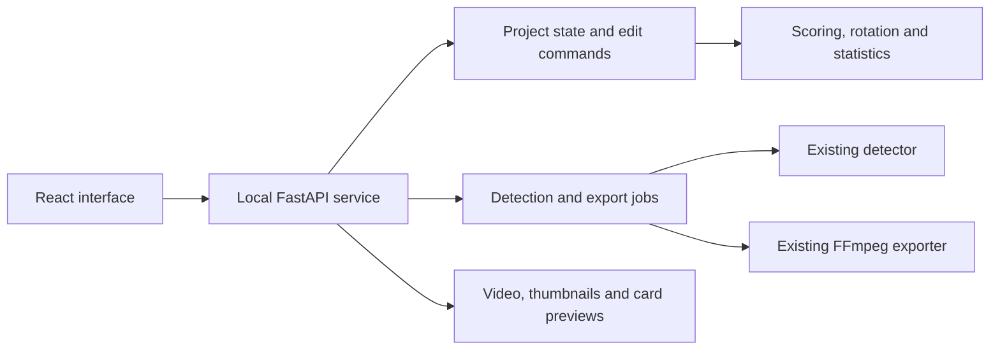

# Frontend simplification: CutServe research and proposed workflow

Research date: October 7, 2026.

This is a design proposal for the existing Roundnet Video Editor. It does not migrate the application or change scoring rules. It combines CutServe's official documentation, the current repository, and the user's requested workflow and stat-card references.

## Recommendation

Use React for a focused interface and FastAPI to expose the existing Python application logic. Keep video processing on the user's computer for the first version. Organize the product around **Setup → Find clips → Review → Export**, with a project dashboard for returning to saved work.

The key UX change is to show the controls needed for the current task. Each stage should have a clear next action. A framework change alone would leave the same crowded workflow in a different toolkit.

## What CutServe documents

| Area | Documented behavior | Useful pattern for our app |
| --- | --- | --- |
| Import | A project dashboard leads to file or YouTube import, then a choice of AI detection or manual clipping. | Guide the user through project creation before showing editor controls. |
| Detection | AI projects use a dedicated four-zone setup screen with a frame picker, undo, and Continue after all zones are drawn. Processing starts automatically. Manual projects skip this stage. | Put court setup and processing in a focused stage. |
| Editing | The editor has a top action bar, a large video player, a bottom filmstrip, and a right panel containing Stats and Clipping sections. | Give the video and selected clip priority. |
| Tagging | Eight outcome shortcuts classify clips. Error opens a single-player picker; defensive categories use an ordered player sequence with undo. Untagged clips are visibly pending. | Ask for player input only when the action needs it. |
| Export | Clean export and Broadcast Studio are separate options. Studio provides a preview and configuration sidebar, reuses match setup, and can insert a stats screen. | Move output decisions to a dedicated preview screen. |
| Highlights | A separate Choose Clips → Edit Reel workflow preselects starred clips. The queue controls order; trims and crop corrections are saved independently. | Treat stars as a shortlist and keep reel assembly separate from match scoring. |

Sources: [Getting Started](https://www.cutserve.app/en/docs/getting-started), [Zone Setup](https://www.cutserve.app/en/docs/zone-setup), [Editor Guide](https://www.cutserve.app/en/docs/editor), [Stat Tagging](https://www.cutserve.app/en/docs/stat-tagging), [Export & Broadcast Studio](https://www.cutserve.app/en/docs/export), [Highlight Reel](https://www.cutserve.app/en/docs/highlight-reel).

### Differences that affect our design

- CutServe's current tagging guide defines Defensive Break as a serving-team win and Defensive Hold as a receiving-team win. The user defined the reverse. Our existing rules and proposed UI retain the user's definitions, with a visible winning-team description on each button. CutServe also uses None as its eighth label; our Redo keeps the clip, awards no points or stats, and preserves the next server and receiver. [Stat Tagging](https://www.cutserve.app/en/docs/stat-tagging)
- The editor guide says match editing requires manual saves; the highlight guide describes autosave for reels. Our proposed interface autosaves both and shows its save status. [Editor Guide](https://www.cutserve.app/en/docs/editor), [Highlight Reel](https://www.cutserve.app/en/docs/highlight-reel)
- The documentation confirms match setup supplies team and player names to export, but the pages reviewed do not fully describe the initial server/receiver wizard. That portion of our proposal follows the user's firsthand description. The export page also gives two conflicting descriptions of what clicking Export opens, so its exact button behavior is not established. [Export & Broadcast Studio](https://www.cutserve.app/en/docs/export)
- CutServe describes local processing. A React frontend can retain that experience by communicating with a local Python service. Its documentation does not establish which frameworks CutServe itself uses. [CutServe overview](https://www.cutserve.app/en)

## Why the current interface feels complicated

The main window presents file import, playing-area selection, court zones, detection, advanced settings, and export together. Its editing controls also include add, reject, split, merge, preview, loop, mark boundaries, correction labels, review filters, training confirmation, and debug graphs.

The point panel adds match setup, statistics, outcomes, named errors, optional touches, captions, and legacy tags. The statistics dialog has multiple analytical tabs, while export combines format, highlights, scoreboard, captions, branding, hardware, correction labels, and the end card.

These are different stages and different levels of detail sharing the same workspace. The existing guided classification is useful, but its surrounding controls make the next step harder to find.

Repository evidence: `ui/main_window.py`, `ui/project_workflow.py`, `ui/statistics_dialog.py`.

## Proposed screens

### 1. Projects

Show **New match** and recent projects. Each project card shows its thumbnail, title, last edit, and current stage. Opening a project resumes where the user left off.

### 2. Match setup

Use a short wizard:

1. Select the local recording.
2. Enter two teams and two players per team.
3. Click the starting server, then a receiver on the opposing team. Show a simple position diagram for confirmation.
4. Choose **Find rallies automatically** or **Mark clips myself**.

Default to 0–0 and a target of 21. Put partial-recording scores and alternative targets under Match options. Explain the limitations of a recording that starts mid-match when that option is used. Keep setup editable from project settings later.

### 3. Find clips

For automatic detection, guide the user through court selection on the video. Bring the existing playing-area, net, and serving-zone tools into this stage, with a short prompt for each action. Adapt these controls to our detector's inputs rather than requiring identical geometry to CutServe.

Use one primary action, **Find rallies**. Show progress, cancellation, and a clear completion action, **Review clips**. Put detector thresholds and diagnostic graphs in Advanced settings.

For manual clipping, open the editor directly with a short empty-state instruction for marking start and end.

### 4. Review editor

```text
Match title        Saved        Undo / Redo       Stats       Export
──────────────────────────────────────────────────────────────────
                                       Clip 12 of 38 · Needs outcome
                                       Team A 7–6 Team B
           VIDEO                       Server: Connor
                                       Receiver: Jacob
                                       What happened?
                                       [Outcome buttons]
                                       [Trim ▾] [More details ▾]
──────────────────────────────────────────────────────────────────
Play / pause      Previous / Next      Star      Add clip
[ Clip 10 ][ Clip 11 ][ Clip 12 ][ Clip 13 ][ Clip 14 ] …
```

The default interaction is **watch → choose outcome → next clip**. Show the score entering the selected clip and the expected server/receiver. After classification, show a short explanation such as “Connor ace: Team A +1; Connor +1 ace; Jacob +1 aced.” Retain the explanation when advancing and make Undo immediately available.

Group the eight buttons by their effect:

| Group | Actions |
| --- | --- |
| Serving team wins | Ace, Service Break, Defensive Hold |
| Receiving team wins | Double Fault, Sideout, Defensive Break |
| Other | Error, Redo |

Include brief descriptions and number-key shortcuts. Error opens four player buttons and requires one culprit. Defensive outcomes can offer **Add defensive touches**, with repeated player clicks and undo. Saving the outcome remains possible without touch details.

Keep precise trim controls in a collapsed section. Put split, merge, captions, and other occasional actions in a clip menu. Use status labels in the filmstrip instead of a separate manual “reviewed” action for every classified clip. If an earlier outcome is missing, explain why later scoring is provisional and provide **Go to missing outcome**.

Distinguish **Not a rally** from **Exclude from exported video**. A real point excluded from the video still counts toward the match. Starring, cropping, and captions should not change statistical completeness.

### 5. Statistics

Start with the four-player card the user supplied. Show final or recorded score, player counts, percentages with numerators/denominators, and rating components. Put formulas and detailed event tables behind expandable explanations.

Show separate summaries for outcome coverage and touch coverage. Known counts update as clips are classified. Touch-dependent percentages, set quality, defensive gets, and RPR remain unknown until the required details are logged, following the user's preference.

Replace scattered completeness flags with computed coverage plus one clear full-match confirmation to identify a final RPR. Running RPR calculates automatically from recorded-point evidence. Coverage checks cannot prove the recording contains every point, so that confirmation remains meaningful.

### 6. Export

First choose **Full match** or **Highlights**. Full match opens the video and end-card preview. Highlights opens a clip shortlist and reorderable queue before cropping and export.

Show only the common choices initially: framing, scoreboard, end card, and destination. Make the end-card duration adjustable with the rendered card visible. Put branding, captions, encoder selection, and correction-label output under More options. Choose hardware encoding automatically when available.

The export preview and final render should use the same Python card renderer so the score, player data, unknown values, and layout agree.

## React and FastAPI responsibilities



| React owns | Python/FastAPI owns |
| --- | --- |
| Screens, selection, playback controls, modal state, loading feedback | Canonical project data, validation, persistence and recovery |
| Sending edit commands and showing returned explanations | Classification, equal serving, score, player stats and undo/redo |
| Filmstrip, crop interaction and export settings | Detection, media probing, previews and final FFmpeg rendering |

Do not implement scoring or rotation a second time in JavaScript. Return a consistent project revision, timeline, statistics, and explanation after an edit. This follows React's guidance to keep state minimal and derive redundant values. [Thinking in React](https://react.dev/learn/thinking-in-react)

### Existing code to reuse

- `models/rally.py`: clip identities, ranges and export/statistical flags.
- `models/match_flow.py`: outcome definitions and serving/score timeline.
- `models/statistics.py` and `models/point_stats.py`: player events, coverage and ratings.
- `models/project.py`: project validation, serialization and edit history.
- `detection/`: rally detection and supporting vision/audio processing.
- `video/exporter.py` and `video/presentation.py`: FFmpeg export and shared end-card rendering.

Project commands and autosave orchestration currently live in the Qt-dependent `ui/project_workflow.py`. Extract these into an application service before connecting React. Replace the Qt worker adapters in `ui/workers.py` with a job manager; the underlying detector and exporter already expose progress and cancellation callbacks.

Detection and rendering should run in managed worker jobs with progress, cancellation, and explicit failure states. FastAPI's documentation distinguishes heavy computation from simple response-following background tasks. A local worker process/job manager is the proposed initial approach; a distributed queue is not necessary for this desktop workflow. [FastAPI Background Tasks](https://fastapi.tiangolo.com/tutorial/background-tasks/)

Serve the selected source or a compatible preview through a media endpoint supporting byte ranges for seeking. Starlette's `FileResponse` supports range requests. Validate playback using the app's actual phone recordings and create a preview proxy where their codec requires it. Keep source timestamps authoritative. [Starlette Responses](https://www.starlette.io/responses/)

A desktop host is still needed for installation, file dialogs, service startup, and shutdown. React plus FastAPI does not choose that packaging layer. Start with a local development UI and API; select packaging after the video and file-access workflow is proven.

## Suggested implementation order

1. Make a clickable screen prototype using representative match data. Verify the setup, classification, trim, and end-card paths before rebuilding the full interface.
2. Extract project/edit services from Qt and expose them through FastAPI, retaining existing domain tests and saved-project compatibility.
3. Connect React setup and the focused editor to real project data and media playback.
4. Add detection/export jobs, the shared end-card preview, and the separate highlights workflow.
5. Package the local application after the complete import-to-export path works.

## Criteria for a successful redesign

- A new user can reach a first classified clip by following visible next actions.
- A typical outcome needs one click; Error adds one player selection.
- Score, individual credit, serving order, persistence, and undo update together.
- Unknown touch-dependent stats remain visibly unknown.
- Missing outcomes and incomplete footage have specific explanations and recovery actions.
- Excluding a real point from export preserves match statistics.
- Highlights do not invalidate RPR eligibility.
- The exported end card matches its preview and selected duration.
- Existing projects can be opened and resumed.

These criteria describe the proposed implementation. This research change only adds this document.
